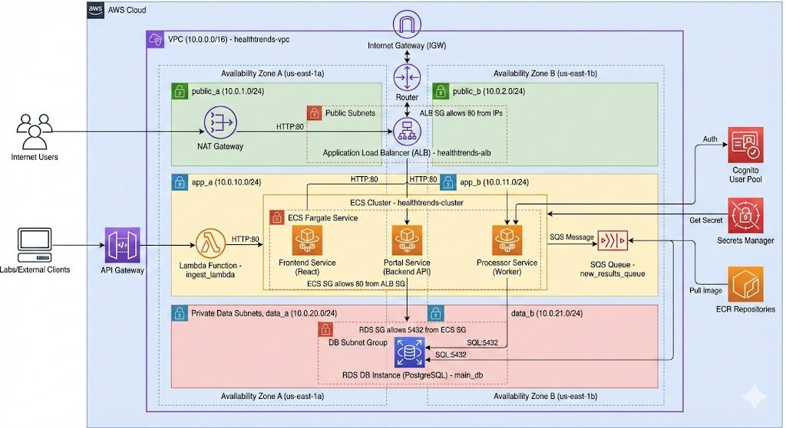

# Architecture Overview

The **Longitudinal Health Analytics Platform** is built on a fully serverless, event-driven architecture optimized for clinical laboratory data ingestion, long-term storage, and health analytics workloads.  
This document provides a detailed explanation of the system’s components, data flow, and design decisions.

---

# 1. High-Level Architecture Diagram

                ┌────────────────────────────────────────┐
                │   Client / Web App / External Systems  │
                └────────────────────────────────────────┘
                                │
                                ▼
                ┌────────────────────────────────────────┐
                │              API Gateway               │
                └────────────────────────────────────────┘
                                │
                                ▼
                ┌────────────────────────────────────────┐
                │            Lambda: Ingest              │
                └────────────────────────────────────────┘
                                │
                                ▼
                ┌────────────────────────────────────────┐
                │               SQS Queue                │
                └────────────────────────────────────────┘
                                │
                                ▼
                ┌────────────────────────────────────────┐
                │     Lambda: Process Lab Result         │
                └────────────────────────────────────────┘
                         /                       \
                        ▼                         ▼
       ┌────────────────────────────────┐   ┌───────────────────────────────────┐
       │            DynamoDB            │   │            S3 Storage            │
       │         (Patient Data)         │   │     (Raw + Processed Data)       │
       └────────────────────────────────┘   └───────────────────────────────────┘
                                │
                                ▼
                ┌────────────────────────────────────────┐
                │          Analytics / ML / BI           │
                └────────────────────────────────────────┘

---

# 2. Components Description

## 2.1 API Gateway
- Acts as the **public entry point** for all API requests  
- Integrates with AWS Cognito for secure JWT authentication  
- Routes requests to appropriate Lambda functions  
- Handles request validation, quotas, CORS, throttling  

## 2.2 AWS Lambda (Compute Layer)
Multiple Lambda functions handle the system’s business logic:

### **IngestLabResult Lambda**
- Validates incoming request
- Publishes the payload to an SQS queue
- Returns a confirmation response to the client

### **ProcessLabResult Lambda**
- Reads messages from the ingestion SQS queue
- Cleans, validates, and transforms lab result data
- Saves structured data to DynamoDB
- Stores raw data and processed JSON in S3

### **GetPatientResults Lambda**
- Retrieves longitudinal lab data per patient
- Performs optional aggregations or sorting

### **ListPatients Lambda**
- Returns all registered patient IDs and metadata

All Lambdas write logs to CloudWatch.

---

# 3. Data Storage Layer

## 3.1 DynamoDB
Used for near-real-time queries:

- Stores **patient records**
- Stores **normalized lab results**
- Provides high scaling capacity with low latency  
- Uses **on-demand billing** to handle unpredictable workloads

### DynamoDB Recommended Schema:
**Partition key:** `patientId`  
**Sort key:** `timestamp`  
Additional attributes:
- `test`
- `value`
- `unit`
- `rawReference`

## 3.2 Amazon S3
Stores:

- Raw lab result uploads  
- Processed/cleaned JSON records  
- Aggregated datasets for analytics  
- Files for long-term archival

Lifecycle policies can automatically migrate data to Glacier for cost reduction.

---

# 4. Messaging & Event Flow

## 4.1 SQS Queue
SQS is used to **decouple ingestion from processing**, enabling:

- Retry handling  
- High-volume bursts  
- Guaranteed message ordering (FIFO optional)  
- Failure isolation  

## 4.2 Event Flow Summary

### 1. Client sends POST /labs request  
↓  
### 2. API Gateway authenticates via Cognito  
↓  
### 3. Ingest Lambda validates input  
↓  
### 4. Message published to SQS  
↓  
### 5. ProcessLabResult Lambda consumes messages  
↓  
### 6. Data is stored in DynamoDB & S3  
↓  
### 7. API users can query results through GET endpoints

---

# 5. Authentication & Security

## 5.1 AWS Cognito
- Manages user accounts  
- Issues JWT access tokens  
- Integrates natively with API Gateway  

## 5.2 IAM Roles & Permissions

### Lambda Execution Role
- Read/write to DynamoDB  
- Read/write to S3  
- Consume messages from SQS  
- Write logs to CloudWatch  

### API Gateway Role
- Invoke Lambda functions  

### Terraform IAM
- Manages roles with least-privilege access policies

## 5.3 Additional Security Features
- HTTPS enforced between all clients and API Gateway  
- Encrypted S3 buckets (AES-256)  
- DynamoDB encryption at rest  
- CloudWatch log retention policies  
- No public S3 buckets  

---

# 6. Monitoring & Observability

## 6.1 CloudWatch Logs
All Lambdas print:
- Input validation status  
- Errors  
- Processing metrics  

## 6.2 CloudWatch Metrics & Alarms
Monitored metrics:
- Lambda errors  
- SQS queue depth  
- API Gateway 4xx / 5xx  
- DynamoDB throttles  
- System latency  

## 6.3 X-Ray (Optional)
For distributed tracing:
- End-to-end request flow  
- Lambda cold start detection  
- Performance bottlenecks  

---

# 7. Architectural Justification

| Requirement | Solution | Reason |
|------------|----------|--------|
| Scalable ingestion | SQS + Lambda | Handles spikes, retry logic |
| Near-real-time access | DynamoDB | Low-latency queries |
| Long-term storage | S3 | Durable + cost-efficient |
| Minimal operational overhead | Serverless stack | No servers to manage |
| Secure API | Cognito + API Gateway | Industry standard authentication |
| Low cost | Pay-as-you-go model | Charges only for usage |

---

# 8. Limitations & Future Improvements

## **8.1 Limitations**
- Lambda cold starts may affect latency  
- S3 provides eventual (not strong) consistency  
- DynamoDB requires pre-defined query patterns  
- No built-in analytics dashboard  
- HIPAA compliance requires additional configuration  

## **8.2 Future Enhancements**
- Replace SQS with **Kinesis** for high-volume streaming  
- Add **Athena queries over S3** for analytics  
- Add **Glue ETL** pipelines  
- Implement **API Gateway usage plans** for rate limiting  
- Add **ML inference** using SageMaker  

